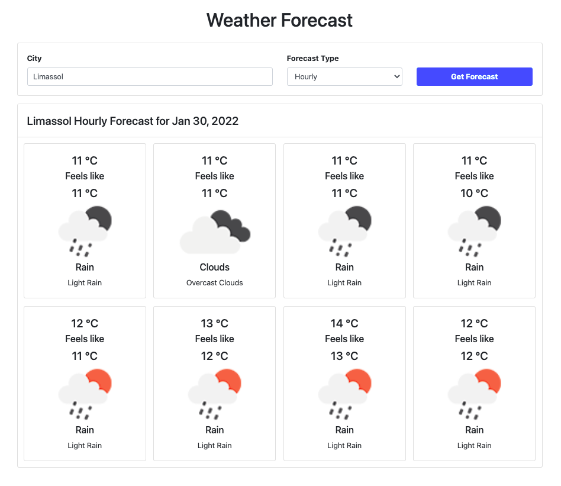

# WeatherApp

This project should show how frontend React web-client could be implemented using functionalities from other libraries.
Connecting to external OpenWeather API services-lib and internal Serverless API services-api.

## Steps

1. Create React web-client frontend - creating components and separating functionalities in other libraries
2. Create TypeScript services-lib library - implementation of OpenWeather API endpoints
3. Create Serverless services-api backend - implementation of OpenWeather API endpoints and cache them using MongoDB

## Layout Example

## Features

- Utilize monorepo and managing repo using [NX](https://nx.dev)
- Code in typescript to be safe
- Using [RxJS](https://rxjs.dev) over Promise cause offers extended features 
- 2 Apps that utilize their frameworks way of implementation
  - [React](apps/web-client) - frontend app developed using functional approach
  - [Serverless](apps/services-api) - backend app developed using AWS architecture
- 3 Libs that common to all apps and they are used by them
  - [Constants](libs/constants-lib) - all constants used in applications
  - [Types](libs/types-lib) - all types used in applications
  - [Helpers](libs/helpers-lib) - all functions used as utils in applications
  - [Services](libs/services-lib) - all services and APIs used in applications

### Web Client Features
- Decoupled implementation leveraging components
- Search the weather forecast hourly or daily for a city
- Search box and two filter options, `hourly` and `daily` in header card
- Title and Tiles for displaying forecast in body card
- In the case of hourly mode, 8 tiles with 3-hour step are showing and in the case of daily mode 8 days.
- Displaying all states Loading, Data, No Found and Error
- Routing for displaying weather specifying city and forecast type
- URL is updated according to the search box and mode

### Libs Features
- [Services](libs/services-lib) features
  - Using the free [OpenWeather](https://openweathermap.org/api) API endpoints.
  - Get location coordinates for entered city `http://api.openweathermap.org/geo/1.0/direct?q={city name}&limit=1&appid={API key}`
    Find forecast for location depending on filter `https://api.openweathermap.org/data/2.5/onecall?lat={lat}&lon={lon}&exclude=current,minutely,daily,alerts&appid={API key}`

## Run
- [React](https://reactjs.org)
  - `nx serve web-client`
- [Serverless](https://serverless.com)
  - `nx serve services-api`
